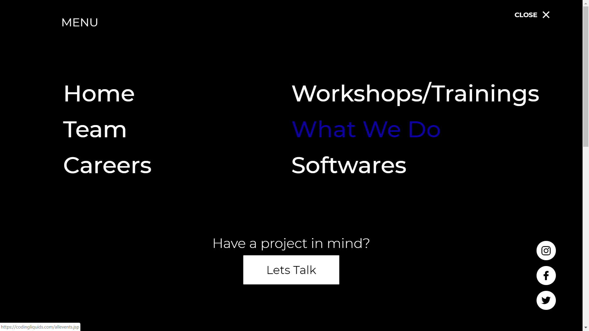
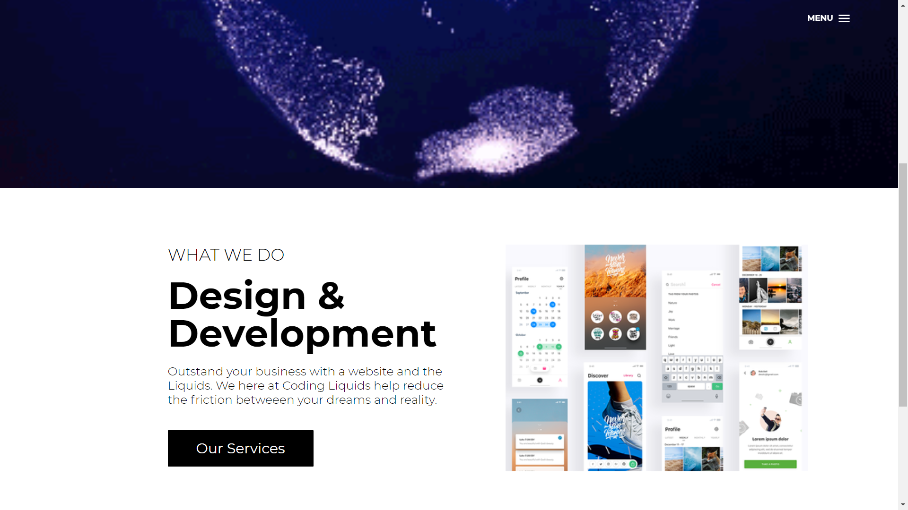
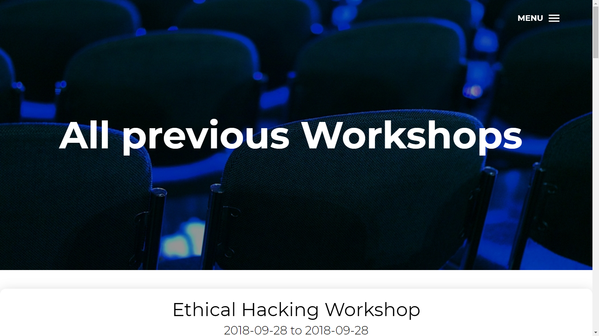
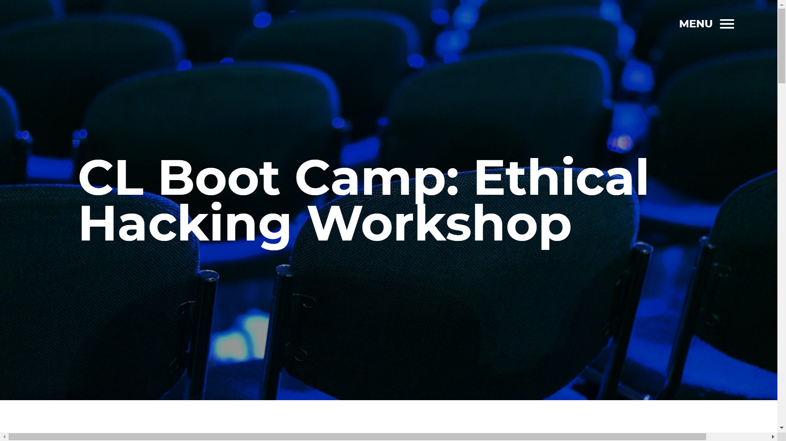

# Coding_Liquids
# All Bug Fixed 

[](https://travis-ci.org/rails/spring)
# URL: https://codingliquids.com
# Git Publish : https://soumyadip007.github.io/Coding_Liquids-StartUp-Company-Live-Website-Using-JSP-Servlet-JSTL-Security-JDBC-MD5-MySql-Bootstrap/
```
Website for a Startup company named Codingliquids. A enterprise website with Admin panel, MVC architecture and Dynamic data parsing .
```

# Image











# Admin panel is not shown for security purposes
